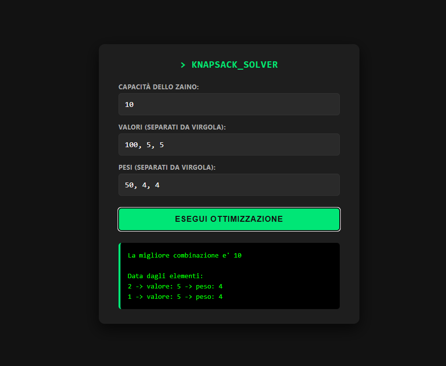

# 🎒 Knapsack Solver: Spring Boot + C Engine

Un'applicazione web full-stack per risolvere il classico **Problema dello Zaino (Knapsack Problem)**.



## 🚀 Architettura del Progetto
Il progetto fa comunicare tre tecnologie diverse in modo fluido:
1. **Frontend (HTML/CSS/JS):** Un'interfaccia web dark-mode servita direttamente da Spring Boot (`src/main/resources/static/index.html`). Raccoglie i dati dell'utente e li invia tramite `fetch` API.
2. **Backend (Java Spring Boot):** Un `@RestController` in ascolto sull'endpoint `/api/ottimizza` che riceve il payload JSON, lo analizza e orchestra l'esecuzione del file binario.
3. **Core Algoritmico (C):** Il file `zaino.c` (compilato in eseguibile) riceve i parametri da Java tramite `ProcessBuilder`, esegue l'ottimizzazione e restituisce il risultato testuale.

## 📋 Prerequisiti
Per eseguire questo progetto sul tuo computer, assicurati di avere:
* **Java JDK 21**.
* **Un compilatore C** (`gcc` raccomandato):
  * *Windows:* [MinGW](https://www.mingw-w64.org/).
  * *Mac:* Xcode Command Line Tools (`xcode-select --install`).
  * *Linux:* `build-essential` (`sudo apt install build-essential`).

---

## 🛠️ Installazione e Avvio

### 1. Clona il repository
```bash
git clone https://github.com/ironsakit/Knapsack_Spring_Boot.git
cd Knapsack_Spring_Boot
```

### 2. Compila il Motore C
Prima di avviare il server, devi generare l'eseguibile compilando il sorgente C presente nella cartella principale.

**Su Windows:**
```bash
gcc zaino.c -o zaino.exe
```

**Su macOS / Linux:**
```bash
gcc zaino.c -o zaino
```
*(Nota: L'eseguibile compilato è ignorato da Git per mantenere il repository pulito e multipiattaforma).*

### 3. Avvia il Server Spring Boot
Usa il wrapper di Gradle incluso nel progetto per avviare il backend:

**Su Windows:**
```cmd
.\gradlew bootRun
```

**Su macOS / Linux:**
```bash
./gradlew bootRun
```

### 4. Apri l'Applicazione
Apri il tuo browser preferito e vai all'indirizzo:
👉 **http://localhost:8080/**
